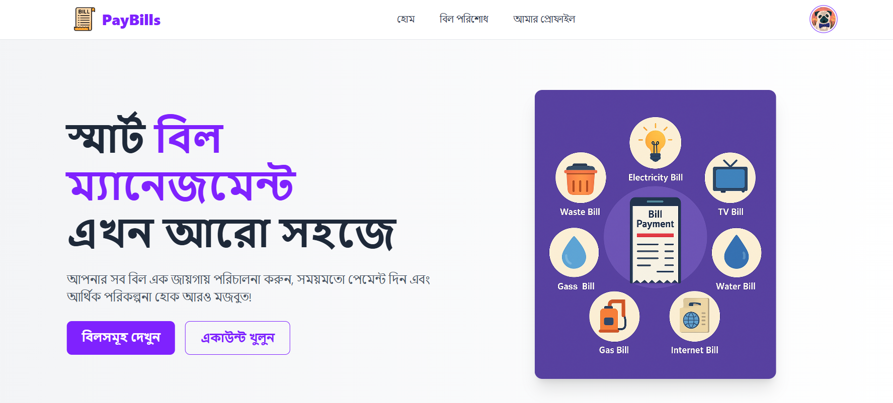

# 💰 Bills Management Web App
<p align="center">
  
</p>

A responsive and user-friendly bill management web application built with React and Firebase Authentication. Users can view, filter, and track paid/unpaid bills with ease. Includes modern UI, dark mode support, and smooth animations.

🔗 **Live Link:** [https://tangerine-sunshine-8227f0.netlify.app/](https://tangerine-sunshine-8227f0.netlify.app/)

---

## 🛠️ Tech Stack

- React.js
- Tailwind CSS
- Firebase Authentication
- React Router DOM
- JSON data for bills

---

## 🚀 Features

- 🔐 User Authentication (Login/Register with Firebase)
- 📃 View all bills in a card-based layout
- ✅ Mark bills as paid
- 🔍 Filter by status (Paid / Unpaid)
- 🌙 Dark mode support
- ⚡ Smooth animations using Framer Motion
- 🔐 Protected Routes based on auth
- 🧑 Profile Update functionality

---

## 📦 Dependencies

- `firebase`
- `react-router-dom`
- `framer-motion`
- `react-icons`
- `sweetalert2`

---

---

## 🖥️ Run Locally

```bash
# Clone the repository
git clone https://github.com/Raihan-143/bills-management.git
cd bills-management

# Install dependencies
npm install

# Start the development server
npm run dev


